# DEGIRO Portfolio

Fork of [RobbeVanHemelryck/degiro-portfolio-history](https://github.com/RobbeVanHemelryck/degiro-portfolio-history).

Portfolio tracker for DEGIRO history: live value, performance per position, and mailbox import of confirmation emails.

Screenshots below use **sample data** (fictional holdings, amounts unrelated to any real portfolio).

## Desktop

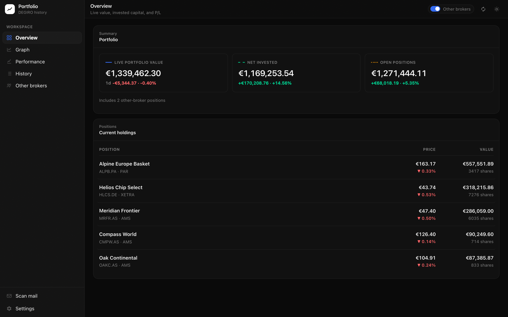

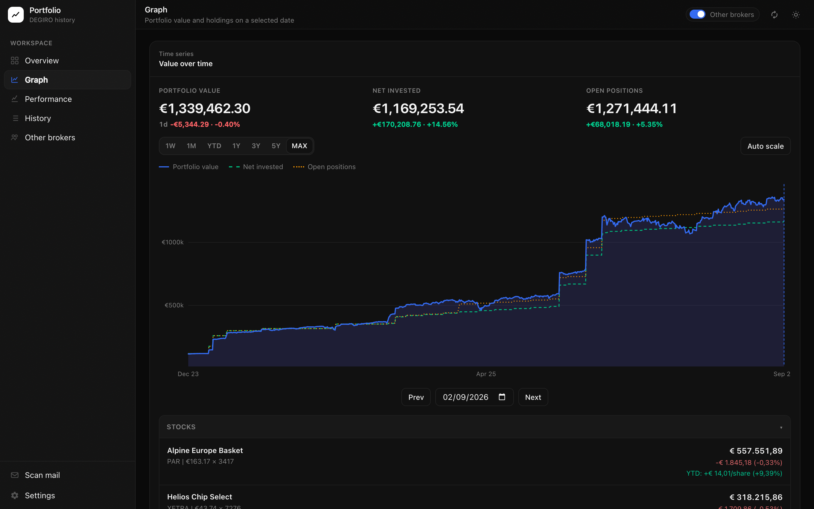

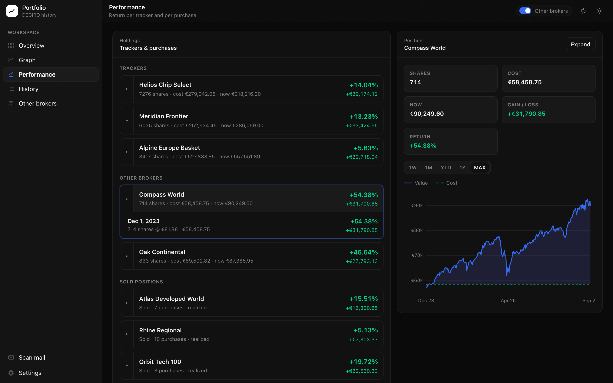

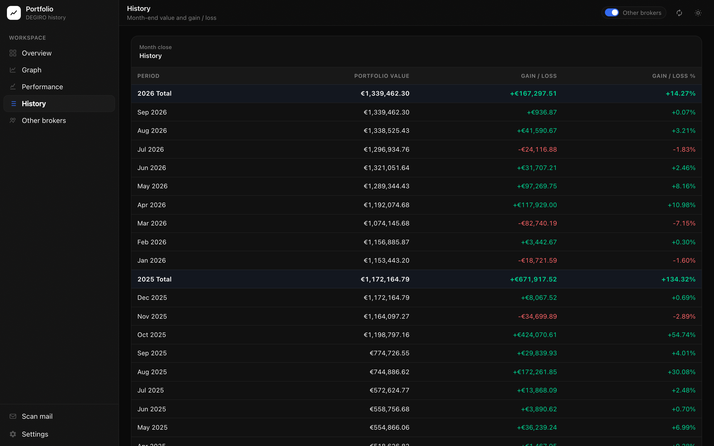

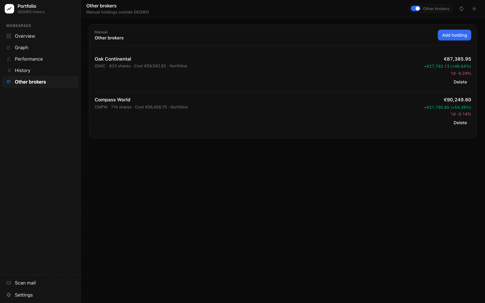

## Mobile

<p></p>

<p>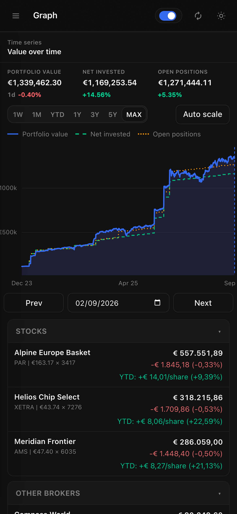</p>

<p>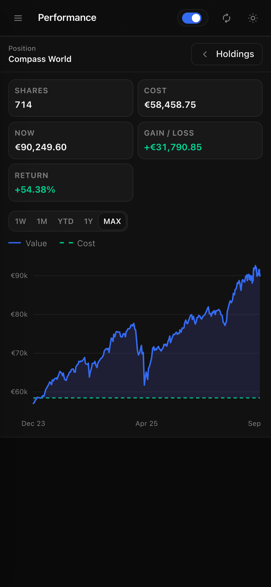</p>

<p>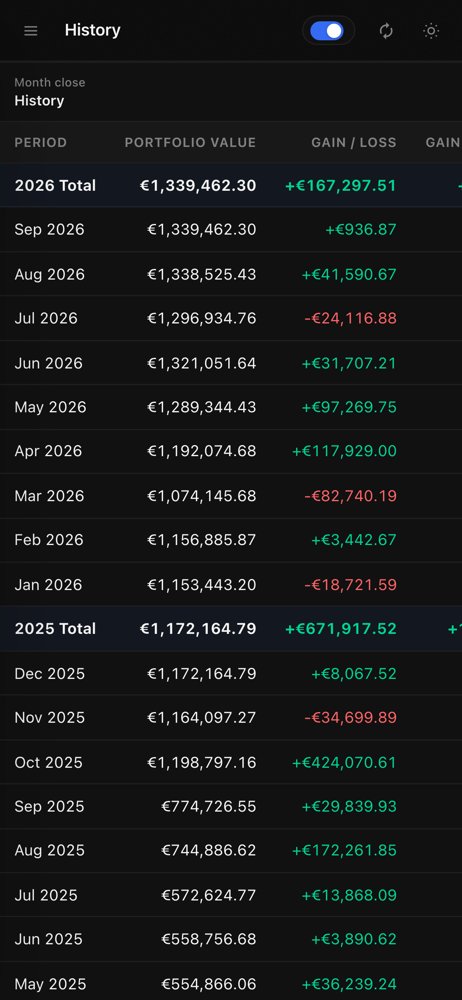</p>

<p>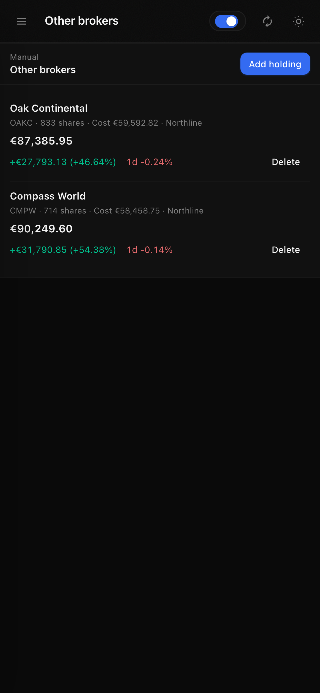</p>

## Mailbox import

Scan DEGIRO **transactiebevestiging** emails over IMAP. New fills are previewed first; you choose what to add. Existing history is not replaced. Duplicates stay visible but cannot be selected.

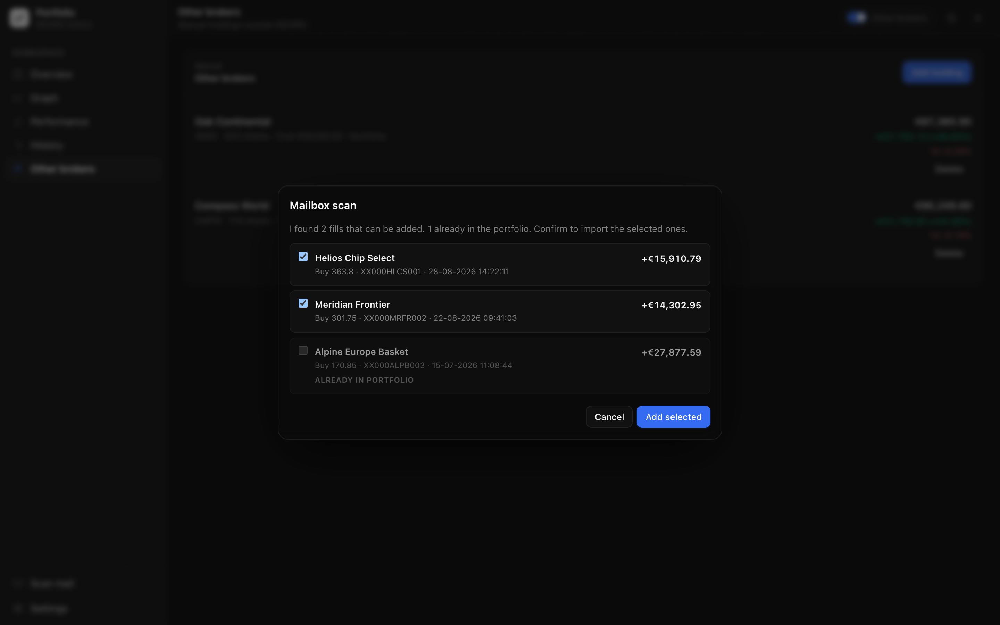

<p>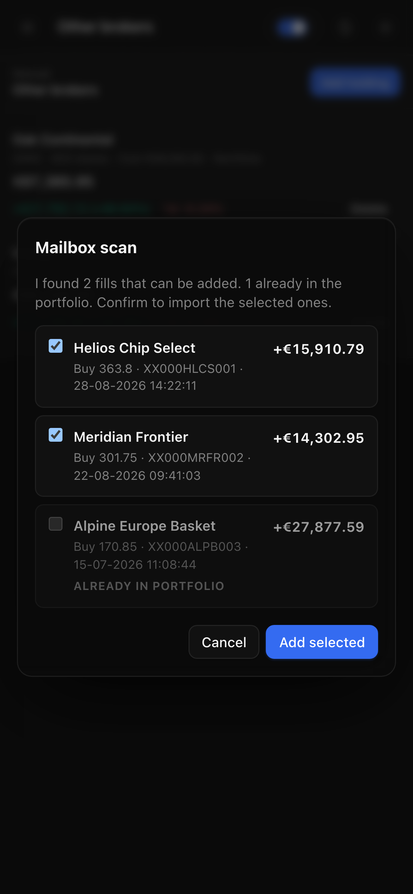</p>

## Run locally

```bash
npm install
npm run dev
```

Open [http://localhost:3000](http://localhost:3000). The SQLite database is stored in `./data`.

## Docker

Build the image from this repository:

```bash
docker build -t degiro-portfolio .
```

Then run it:

```yaml
degiro-portfolio:
  image: degiro-portfolio
  ports:
    - 8000:8000
  volumes:
    - <database-folder>:/config
```

The app listens on port `8000` inside the container. Persist the SQLite database by mounting a folder at `/config`.

## Import data

1. In DEGIRO: Reports → Transactions → export Excel → **Upload transactions**
2. In DEGIRO: Reports → Account statement → export Excel → **Upload account statement**
3. Optional: connect a mailbox in Settings and **Scan mail** to add confirmation fills without wiping history
